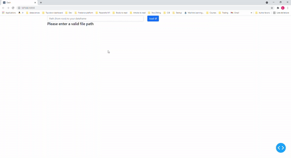
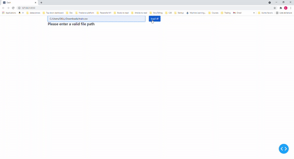
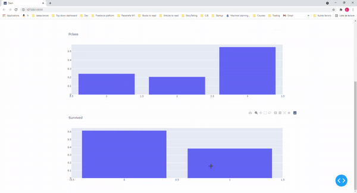
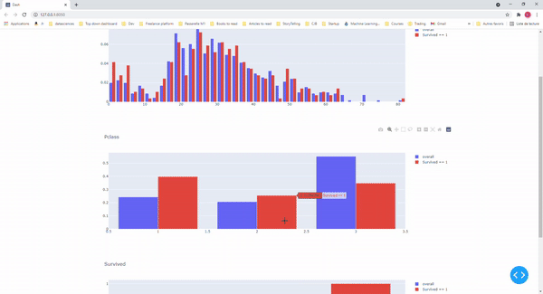
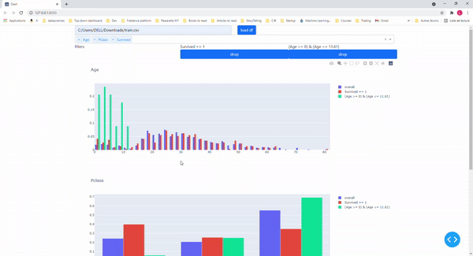

# Smoof

TopDownDash is a framework for exploring datasets frictionless

## Installation

Clone this repository in a new directory.

## Prequistes

- Anaconda installed

## Installation

```bash

$ path/to/this/dir conda env create -f environment.yaml
$ path/to/this/dir conda activate smoof
$ path/to/this/dir pip install e .

```


## Usage


### Launch the app

```bash

$ path/to/this/dir smoof

```

### Load a dataset



### Select variables to plot



### Click and filter

On bar plots only.



### Drag and filter

On histogram only.



# Drop filter




## Contact

If you want to contact me you can reach me at leopoldavezac@gmail.com.


## License

This project use the following licence, [MIT](./LICENCE)